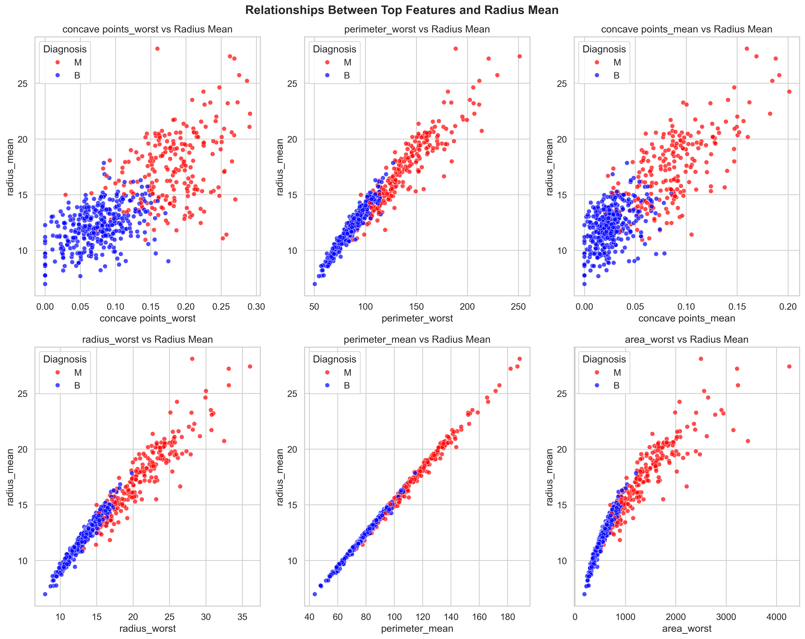
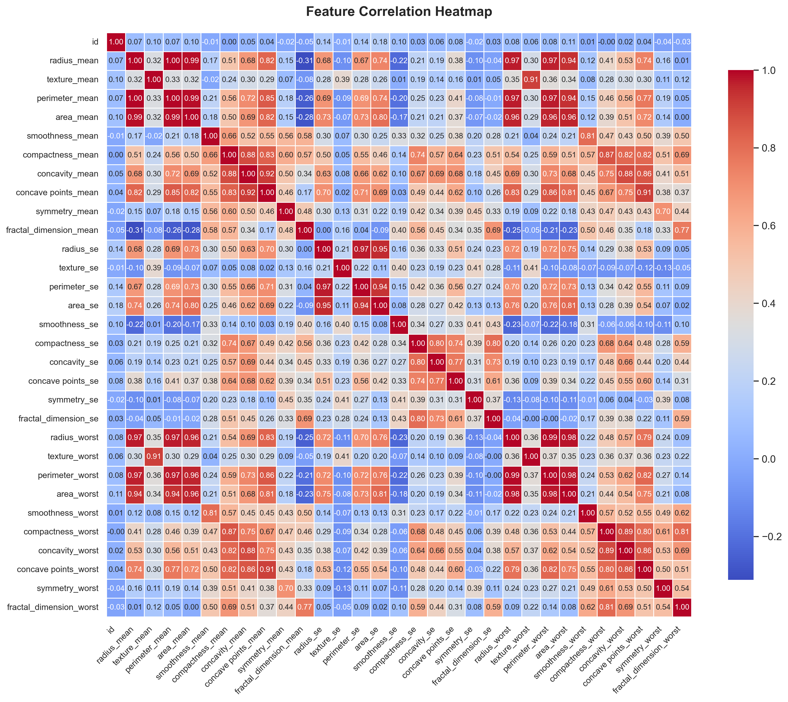
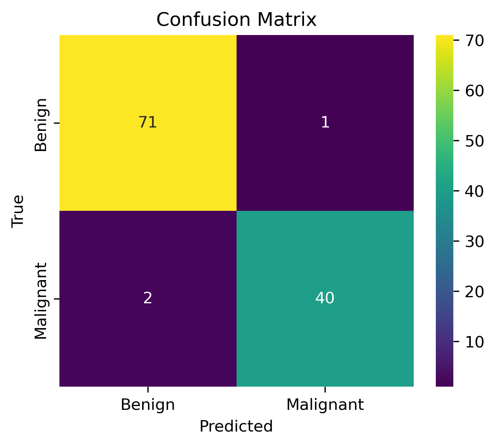
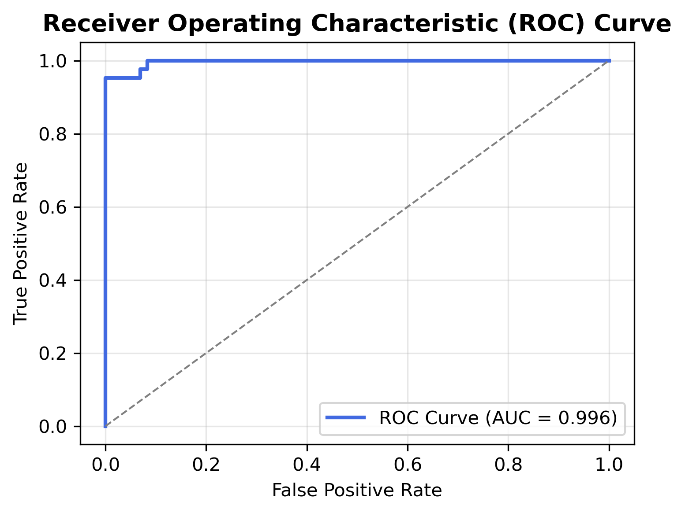

# Interpretable Breast Cancer Prediction Model

This repository contains the implementation of a transparent and interpretable machine learning model designed to predict whether a breast tumour is benign (B) or malignant (M) based on diagnostic features from the UCI Breast Cancer Wisconsin Dataset.

The project was completed as part of the Model Engineering  module for the BSc Data Science degree program.

---

## Project Overview
- Task: Support a group of oncologists with the interpretable prediction model to allow for additional indications that can be produced automatically as well as support understanding to ease technology acceptance.  
- Goal: Achieve F1-score ≥ 0.95 and provide feature-level interpretability to support oncologist decision-making.  
- Methodology: Follows the CRISP-DM process.  

---

## Final - Optimised model performance
The final model scored an overall accuracy of 0.9737 and a F1 score of 0.9639 on the test data. Both tumour classes were predicted accurately:


## CRISP-DM Framework

This project followed the CRISP-DM (Cross Industry Standard Process for Data Mining) methodology:
1. Business Understanding: Define project goals and success criteria
2. Data Understanding: Load and explore data for patterns and bias
3. Data Preparation: Clean, encode, and scale features
4. Modeling: Train and compare six ML algorithms
5. Evaluation: Assess accuracy, precision, recall, F1, and ROC-AUC
6. Deployment: Save optimized model and propose a GUI for clinical use

---

## Repository Structure
```bash
breast-cancer-ml-interpretability/
│
├── data/
│   ├── raw/                
│   ├── processed/          
│   └── external/           
│
├── notebooks/
│   ├── 01_EDAv3.ipynb        
│   └── 02_Model_Trainingv2.ipynb  
│
├── src/
│   ├── data_preprocessing.py   
│   ├── model_training.py       
│   └── visualization.py        
│
├── models/
│   ├── saved_model/           
│   └── model_results/          
│
├── reports/
│   ├── figures/                
│   └── final_report.pdf        
│
├── requirements.txt
└── README.md

```

---
# EDA graphs
## Diagnosis Distribution
<p align="center">
  
</p>

## Hist & KDE - Feature Distrubution

<p align="center">
  
</p>

## Boxplots - Outlier Detection
<p align="center">
  
</p>

## Pair plots - Relationship Detection
<p align="center">
  
</p>

<p align="center">
  
</p>


## Correlation Heatmap

<p align="center">
  
</p>


## Model Results
<p align="center">
  
</p>

<p align="center">
  
</p>


## Top 10 Import features
<p align="center">
  
</p>

---
# Detailed Error analysis
A detailed error analysis was done to investigate the three misclassified cases. 
## Confusion Matrix
<p align="center">
  
</p>


## ROC AUC
<p align="center">
  
</p>


## FP & FN distribution
<p align="center">
  
</p>

---

## Proposed GUI Layout
<p align="center">
  
</p>

---

## Model Interpretability
The Logistic Regression coefficients were used to rank feature importance.
The top predictive features included:
- radius_se
- texture_worst
- concavity_worst
- area_worst

These correspond to known medical indicators of tumour irregularity and malignancy, reinforcing the model’s reliability and transparency.

---
## Conclusion
In this case study, an interpretable machine learning model for breast cancer classification was successfully developed. The CRISP-DM methodology was followed from data understanding to deployment planning. 
Class distribution, outlier detection, feature distribution, correlation heatmap and scatterplots were done during the EDA – Exploratory Data Analysis. It was confirmed that features like the tumour size, irregular shape and texture variation are key indicators of Malignant cancer. This is consistent with established medical knowledge. 
The data was cleaned and one-hot encoded during the preparation phase. Multiple models were trained and tested on the same data. The performance of the model and the interpretability of the models were weighed to determine the best model for the task.
The optimized Logistic Regression model achieved the best performance with an overall accuracy of 0.9737 and a F1 score of 0.9639. Model transparency together with an easy to explain model, builds trust with oncologist in the system.
The proposed GUI shows how a model might be integrated into hospitals. Despite the model's good performance, real world deployment will require periodic retraining to prevent model drift. Future improvements may include more features on the GUI and an integration into a MLOps pipeline for continuous monitoring.
This project demonstrated that interpretable Machine Learning models can serve as a valuable decision support tool for oncologists. The goal is to assist, not replace expert judgement with reliable, data driven insights.  

---


## License

This repository is released for educational and academic purposes only.
It must not be used for clinical or diagnostic decision-making.

